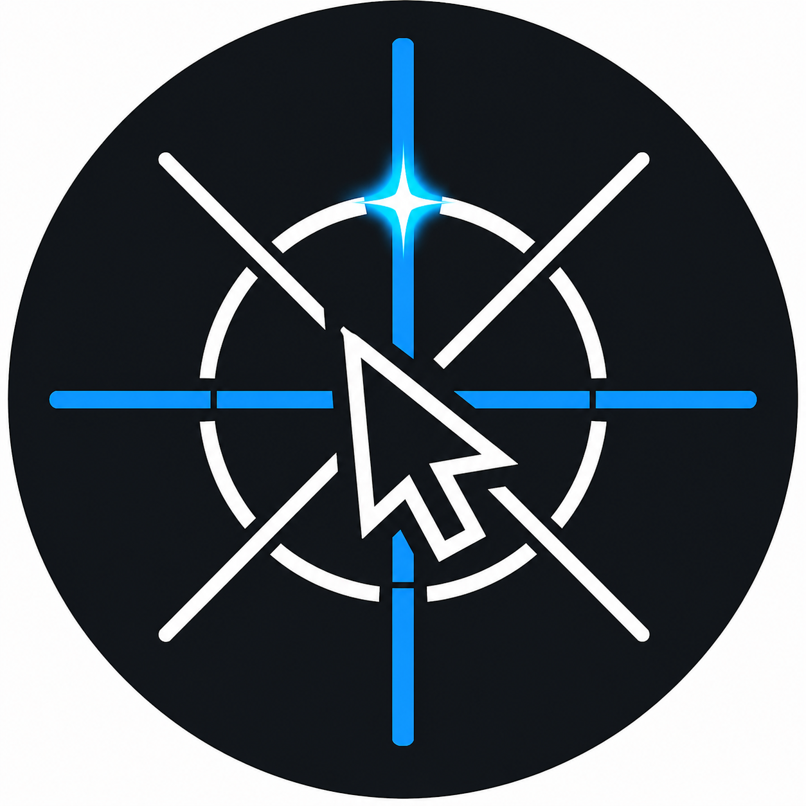

# Precision Cursor



Windows tray utility that constrains global cursor movement to clean horizontal, vertical, or 45-degree diagonal lines while enabled.

It is built for drawing, annotation, layout work, and any workflow where you want the pointer to travel in precise straight paths without fighting hand jitter.

## Features

- Global Windows tray app.
- 8-way line locking: left, right, up, down, and four diagonals.
- Raw mouse input based direction detection.
- Sticky direction smoothing to reduce wobble and stair-step diagonals.
- Global hotkeys for quick control.
- No NuGet packages required.

## Controls

- `Ctrl+Alt+L`: toggle line-lock on or off.
- `Esc`: disable line-lock immediately.
- Tray menu: shows status, toggles line-lock, or exits.
- Double-click the tray icon to toggle line-lock.

When enabled, the app watches raw mouse movement and snaps each segment to the nearest of the 8 compass directions. You can move sideways, then turn upward, downward, left, right, or diagonally without toggling the tool off and back on.

## How It Works

Precision Cursor combines raw mouse input with a low-level mouse hook:

- Raw input reads the real hardware movement delta.
- The lock engine chooses the nearest 8-way direction and smooths noisy movement.
- The mouse hook suppresses unsnapped physical movement while enabled.
- The app sets the cursor only to the locked position.

## Build

This repository targets .NET Framework 4.8 and uses Visual Studio MSBuild. It does not require NuGet packages.

```powershell
powershell -ExecutionPolicy Bypass -File .\scripts\build.ps1
```

## Test

```powershell
powershell -ExecutionPolicy Bypass -File .\scripts\test.ps1
```

## Run

After a Release build:

```powershell
.\src\PrecisionCursor\bin\Release\PrecisionCursor.exe
```

## Project Structure

- `src/PrecisionCursor`: Windows Forms tray app, hooks, raw input.
- `src/PrecisionCursor.Core`: line snapping and smoothing logic.
- `tests/PrecisionCursor.Tests`: console test runner for core behavior.
- `assets/logo.png`: project logo.

## Logo

The logo was generated with GPT Image 2 and integrated as the Windows executable/tray icon.
